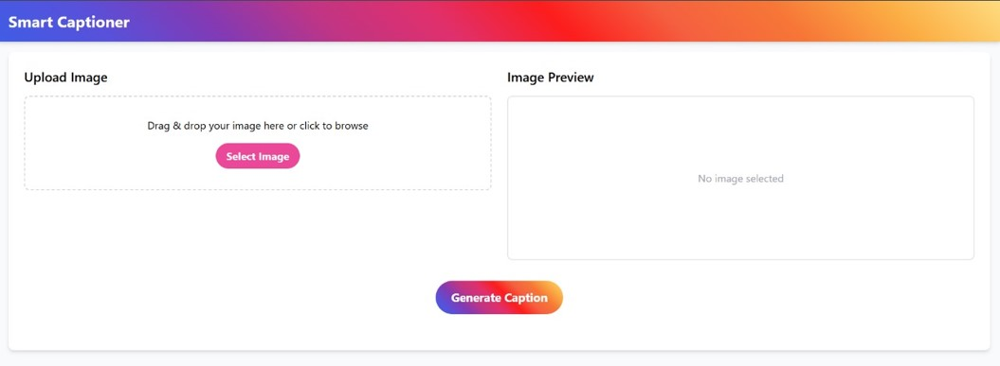
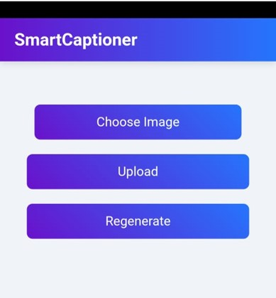

# SmartCaptioner

**Smart Captioner** is an AI-powered image caption generator that analyzes uploaded images and suggests the most relevant and engaging Social media-style captions. The system uses the CLIP model to understand image content and predict its category from 16 possible types, then returns 5 suitable captions.

## Features

- Upload an image and get **5 creative, category-based captions**
- Trained on a self made **custom dataset of 1600 images** 
- Uses **OpenAI's CLIP** model for image classification
- Supports **16 unique image categories**
- Clean and user-friendly **Django web interface**
- Fully functional **Android app built using Kodular**

##AI Model - CLIP

The project uses CLIP (Contrastive Language–Image Pretraining) from OpenAI to classify the uploaded image into one of the 16 categories. Based on the predicted category, the app randomly selects 5 captions from a curated text file containing category-specific captions.

##Future Enhancements

Add multilingual caption support
Let users vote or like captions
Fine-tune CLIP or use other vision-language models for better accuracy
Add user profiles to save captions or recent uploads

## ⚠️ Note

Due to the large number of images (1600+), the full Django project directory could not be uploaded to GitHub.  
Instead, this repository contains:

- 📄 **Project Presentation (PPT)**
- 🖼 **Screenshots** of the working **Django web interface** and **Kodular Android app**
- 🧠 The core logic of the **CLIP-based classifier**

> If you'd like access to the full working project with all images and data, feel free to contact me.

#Website Overview

#App Overview

[Download PPT](major_ppt.pptx)

